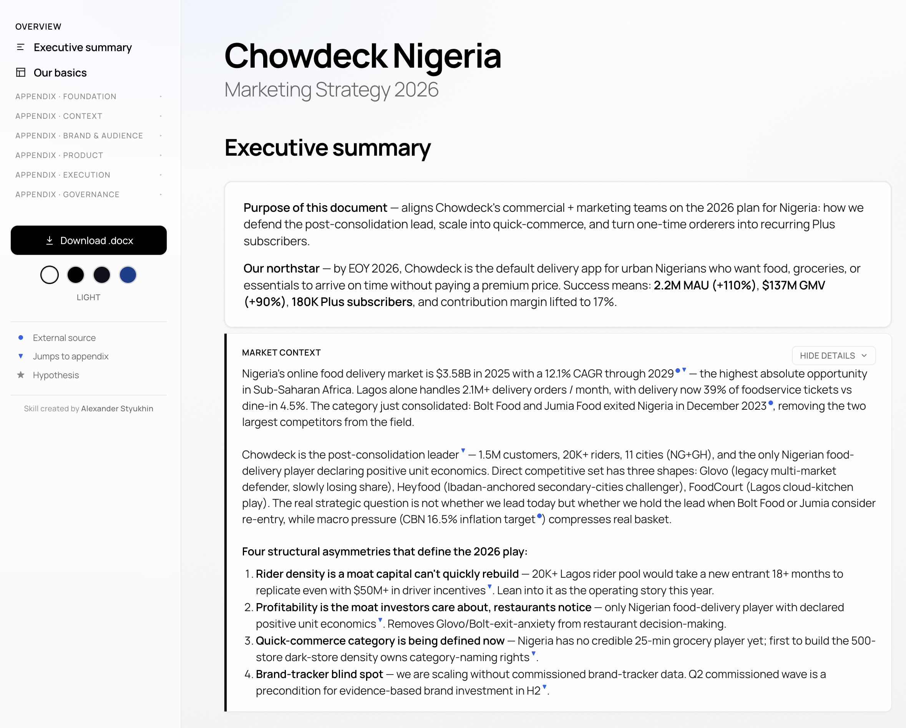
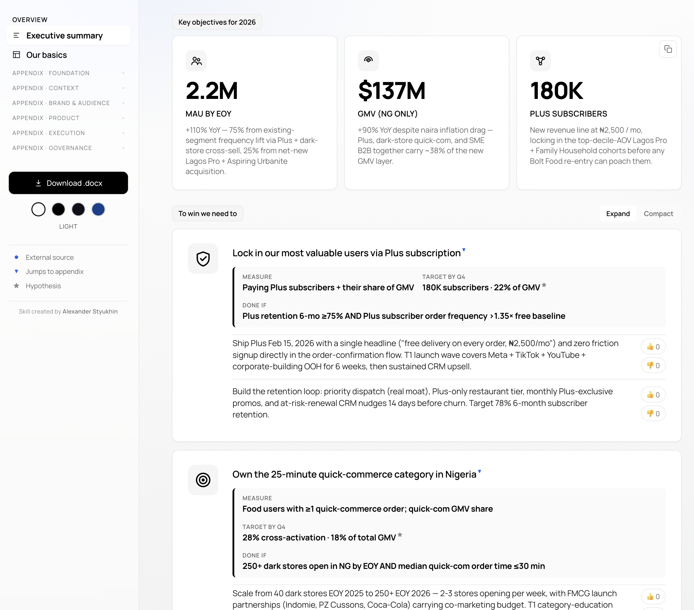
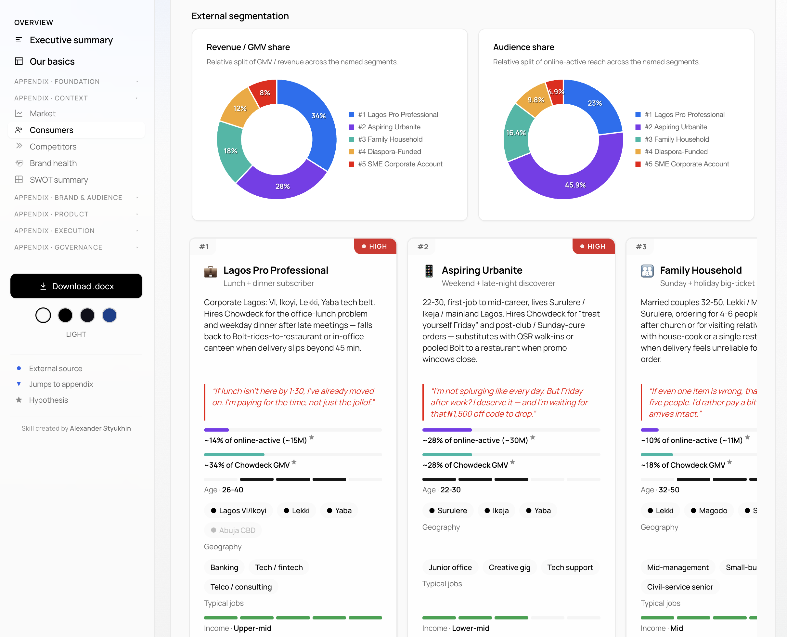
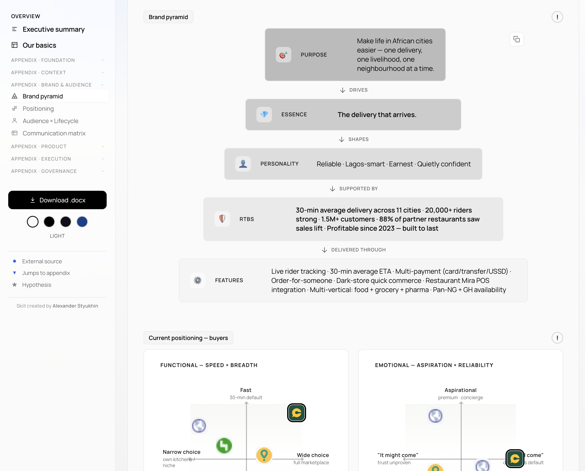
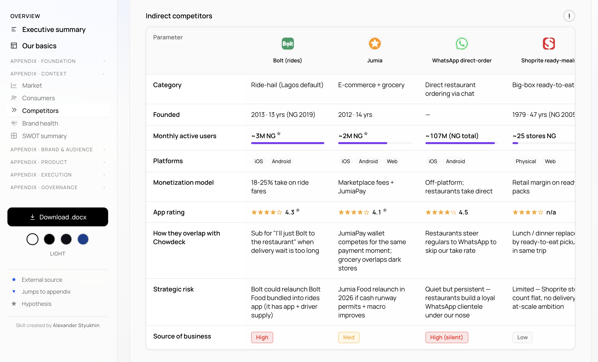
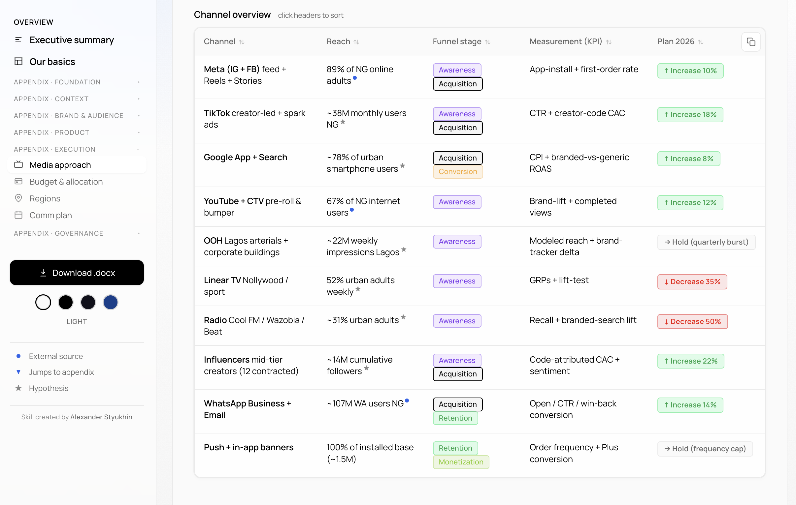
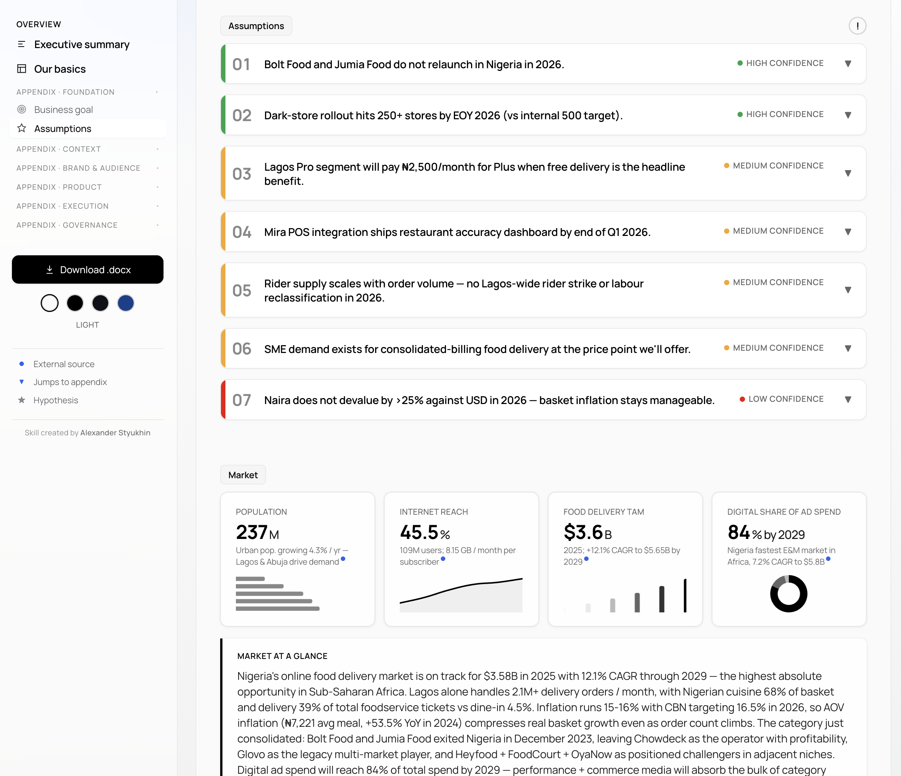

# Marketing Strategy Skills for Claude Code

Two Claude Skills that turn a short interview (or an uploaded document) into a publish-ready marketing strategy artefact. Output is always a single interactive HTML dashboard, with a built-in `.docx` export button.

Latest release: **[v1.4.0](https://github.com/stukhin/b2c-marketing-strategy-skill/releases/latest)** · visual system unification + animation polish + cleanup.

---

## What's in this repo

This is a monorepo holding two related but independent Claude Skills:

### 📊 [`b2c-marketing-strategy`](./b2c-marketing-strategy/) · **writes annual marketing strategies** (v1.4.0)

Turns a 2 / 9 / 22-question interview into a 20-section interactive dashboard covering market context, consumers, competitors, brand health, SWOT, brand pyramid, positioning, audience × lifecycle, communication matrix, product initiatives, media, MMM (budget × ROAS), regional plan, communication plan, risk register, references, executive summary, basics, business goal, assumptions, next steps. Three modes (Fast / Guided / Deep), 16 industry presets, English or Russian output.

Full docs → [`b2c-marketing-strategy/README.md`](./b2c-marketing-strategy/README.md)

### 🔍 [`marketing-strategy-audit`](./marketing-strategy-audit/) · **audits existing strategy documents** (v1.0)

Takes uploaded strategy docs (PDF / PPTX / DOCX / plain text), scores them on a 7-criterion rubric (Specificity / Verification / Risk register quality / Action specificity / Synthesis integrity / Reality check / Completeness), and surfaces non-obvious insights the document itself doesn't articulate — cross-doc inconsistencies, hidden assumptions, missed data opportunities, reality gaps via web search.

Full docs → [`marketing-strategy-audit/README.md`](./marketing-strategy-audit/README.md)

---

## Quick install

You need [Claude Code](https://claude.ai/download) (free, available for macOS / Windows / Linux).

**Grab the latest `.skill` archives from Releases:**

- [`b2c-marketing-strategy.skill`](https://github.com/stukhin/b2c-marketing-strategy-skill/releases/latest/download/b2c-marketing-strategy.skill) (~156 KB)
- [`marketing-strategy-audit.skill`](https://github.com/stukhin/b2c-marketing-strategy-skill/releases/latest/download/marketing-strategy-audit.skill) (~32 KB)

Drag either file into Claude Code, or drop into `~/.claude/skills/`. Restart Claude Code if the skill doesn't appear.

Invoke with `/b2c-marketing-strategy` or `/marketing-strategy-audit`. Or simply ask in natural language: *"Generate a marketing strategy for [Brand] in [Country]"* / *"Audit this strategy deck"*.

**Pro tip — set up permissions before first run.** A full run touches dozens of files. Without pre-approved permissions, Claude Code will prompt "Allow?" 40+ times. Add these to Settings → Permissions:

- `Read(*)` · `Edit(output/**)` · `Bash(python3 -c *)` · `Bash(grep:*)` · `WebSearch`

One-time setup, then runs proceed without interruptions.

---

## Subscription reality — which Claude plan can run this skill

Honest guidance from real tester runs. A "full skill run" means interview → research sweep → 20-section dashboard → self-check → ready to share.

| Plan | Cost | Realistic skill usage |
|---|---|---|
| **Free Claude Code** | $0 | ❌ **Won't complete a single run.** No skill-running budget — the run will pause / fail before finishing the dashboard. |
| **Pro** | $20 / mo | ⚠️ **Tight.** A single Mode 1 run sometimes fits the 5-hour rolling window, but iteration (a second run on the same day, or retries after errors) drains the window. Mode 2 / Mode 3 routinely bust the limit and resume the next day. |
| **Max — $100 / mo** | $100 / mo | ✅ **Realistic minimum for comfortable use.** Mode 1 + iteration comfortable. Mode 2 single-session feasible. |
| **Max — $200 / mo (20×)** | $200 / mo | ✅✅ **Best for active use.** Mode 2 / Mode 3 single-session comfortable, multiple iterations per day. |
| **API direct** (Anthropic API) | Pay per token | ✅ No daily limits. Per-run API cost ~$1-5 with Sonnet 4.6. Best if you're running this often or building automation on top. |

If you only want to try the skill once to see what it produces — Pro is OK for a single Mode 1 attempt (might still hit limits, but cheap to try). **If you plan to use this regularly, budget for Max $100/mo as the realistic floor.**

---

## What the output looks like

Screenshots from a real Fast-mode run — a food delivery brand strategy. Same dashboard, different sections.

### 1 · Executive summary



Landing view of the dashboard. Purpose-of-document + northstar block, then market context with hard numbers and the 4 structural asymmetries shaping the year's play.

### 2 · Key objectives



Three hero metrics that define what success looks like. Locked to exactly 3 tiles as a forcing function — if you can't pick 3, you don't have a plan, you have a wishlist.

### 3 · Consumer segmentation



Revenue / GMV share and audience share donuts auto-derive from segment-card data below. Each card carries reach %, sensitivities, voice-of-customer quote, preferred competitors, primary channels. Up to 8 segments in a horizontal scroller.

### 4 · Brand pyramid + positioning maps



Purpose → Essence → Personality → RTBs → Features hierarchy, plus functional + emotional positioning maps with competitor placement.

### 5 · Competitive landscape



Direct + indirect competitor tables with sticky first column, parameter-by-parameter comparison, app ratings, monetization model, strategic risk per rival.

### 6 · Media plan



10+ channel rows with reach, funnel stage, KPI, and Plan-direction chip (↑ Increase / → Hold / ↓ Decrease). Theme switcher visible in left sidebar — 4 themes flip instantly via View Transitions API.

### 7 · Assumptions + market KPI tiles



3-tier confidence cards (High / Medium / Low) anchor what the year is betting on. Each card carries claim + leading signal + trigger (collapsed by default, click to expand). Market KPI tiles below show 4 macro signals with mini-charts.

---

## How it works (in 30 seconds)

1. Start a new Claude Code session, type `/b2c-marketing-strategy`
2. Pick a mode (Fast ~5min interview / Guided ~15-20min / Deep ~30-45min) and output language (EN / RU)
3. Answer the interview — brand + market, use case + stage, plus 7-20 prioritised fillers depending on mode
4. The skill runs a parallel research sweep via `web_search` (DataReportal, Statista, World Bank, Sensor Tower, industry press), then fills the 20-section dashboard
5. Self-check verifies the output is free of placeholder leaks
6. Open `output/<brand>-<market>-v1.html` in any browser

Every fact-looking number is plated: blue dot for verified external source (with T1/T2/T3 tier), `★` for hypothesis, `[to be confirmed]` for internal-only fact only you can provide. Nothing reads as fact without a source plate.

For wall-clock time + token cost expectations + Pro vs Max plan guidance, see the [skill-specific README](./b2c-marketing-strategy/README.md#token-cost-and-wall-clock-expectations).

---

## What this is — and what it isn't

**This skill IS:**

- A **structured first pass** at an annual marketing strategy doc — covers every section a CMO would expect (market, segmentation, competitors, brand pyramid, positioning, media plan, MMM, risk register, etc.) so you don't skip anything.
- A **scaffolding** for an annual planning workshop. Saves the 2-3 weeks usually spent structuring the doc and gathering baseline data.
- A **sounding board for hypotheses**. Every claim is marked verified / hypothesis / to-be-confirmed — so you can argue with the document rather than start from a blank page.
- An **adaptive starting point**. The skill works with whatever data you can provide — public coverage only (Fast), one internal doc (Guided), full document upload (Deep). Hypothesis density scales with what you feed it.

**This skill IS NOT:**

- A **replacement for strategy work itself**. Final positioning, brand pyramid, creative direction, year-defining bets still need human creative + workshop input. The skill proposes a default; the team picks.
- A source of **validated market data**. Hypothesis-marked numbers (`★`) are the AI's best guess from public research — they **must be calibrated** against your team's actuals before being shared externally.
- A substitute for **specialist work**. Real brand-tracker waves, qualitative segmentation studies, MMM models, creative testing, financial planning — all still need their respective teams. The skill makes a first-cut hypothesis the specialists can validate or replace.
- A **finished, board-ready document**. Treat the output as a draft for internal review, not a strategy ready to present without human editing.

**Best used as:**

- Pre-work for an annual planning workshop (the skill brings the structure + baseline data; the workshop fills the strategic judgment)
- A sounding board when validating direction with founders / leadership ("here's what a default plan for this market looks like — what's wrong with it?")
- Onboarding doc for a new marketing hire who needs to learn the category fast
- A "what does our strategy doc look like" living template, refreshed every annual cycle

Quality of output scales hard with what you feed the skill. Mode 1 with no documents gives 70-80% hypotheses — useful sketch, far from a final doc. Mode 2 with one internal document (last year's plan, brand tracker, segmentation study) cuts hypothesis density to 30-50%. Mode 3 with multiple uploaded documents cuts it to 10-20% — closest to consultant-grade.

---

## Versions

| Version | Date | Highlights |
|---|---|---|
| **v1.4.0** | 2026-05-24 | Visual system unification — chip / table / comm-matrix consolidation, View Transitions API on theme switch, smooth `<details>` animations |
| v1.3.2 | 2026-05-24 | Manrope font adoption + Chart.js label font fix |
| v1.3.1 | 2026-05-24 | Remove "Etc." stubs and `Add another` placeholders |
| v1.3.0 | 2026-05-24 | Fast-mode honesty pack — banner + confidence chips + Mode-aware depth caps |
| v1.2.1 | 2026-05-23 | Self-challenge fix-pass + cleanup duplicate root paths |
| v1.2.0 | 2026-05-23 | Monorepo restructure + add `marketing-strategy-audit` skill |
| v1.0–v1.1 | 2026-04 → 05 | Consolidation after 11 patches' worth of real-tester feedback |

Full release notes on each tag: [Releases page](https://github.com/stukhin/b2c-marketing-strategy-skill/releases).

---

## Repository structure

```
b2c-marketing-strategy-skill/
├── b2c-marketing-strategy/          ← Skill 1 — writes annual strategies (v1.4.0)
│   ├── SKILL.md                       Workflow brain
│   ├── README.md                      Detailed docs for this skill
│   ├── LICENSE                        CC BY-NC-SA 4.0
│   └── references/                    Template + presets + question banks
├── marketing-strategy-audit/        ← Skill 2 — audits existing strategy docs (v1.0)
│   ├── SKILL.md
│   ├── README.md
│   ├── LICENSE
│   └── references/
├── .gitignore                       Excludes archives + .skill + output/
└── README.md                        You are here
```

`.skill` archives + local `output/` directory are gitignored — built artefacts ship via GitHub Releases, generated dashboards stay local.

---

## License

Both skills released under [Creative Commons Attribution-NonCommercial-ShareAlike 4.0 International (CC BY-NC-SA 4.0)](https://creativecommons.org/licenses/by-nc-sa/4.0/).

You may use, share, and adapt for **non-commercial purposes** with attribution. Any derivative work must be released under the same license. Commercial use requires explicit written permission from the author.

---

## Author

Built and maintained by **Alexander Styukhin** — Chief Marketing Officer with 15+ years across marketplaces, fintech, ride-hail, food delivery. The skills are a personal side-project: a way to turn the playbook I've used across hundreds of strategic planning cycles into something other CMOs can actually run.

- LinkedIn: [linkedin.com/in/stukhin](https://www.linkedin.com/in/stukhin/)
- Issues / feedback / category-specific gaps: please open a GitHub Issue or DM on LinkedIn — real-world failure modes drive every meaningful improvement.
